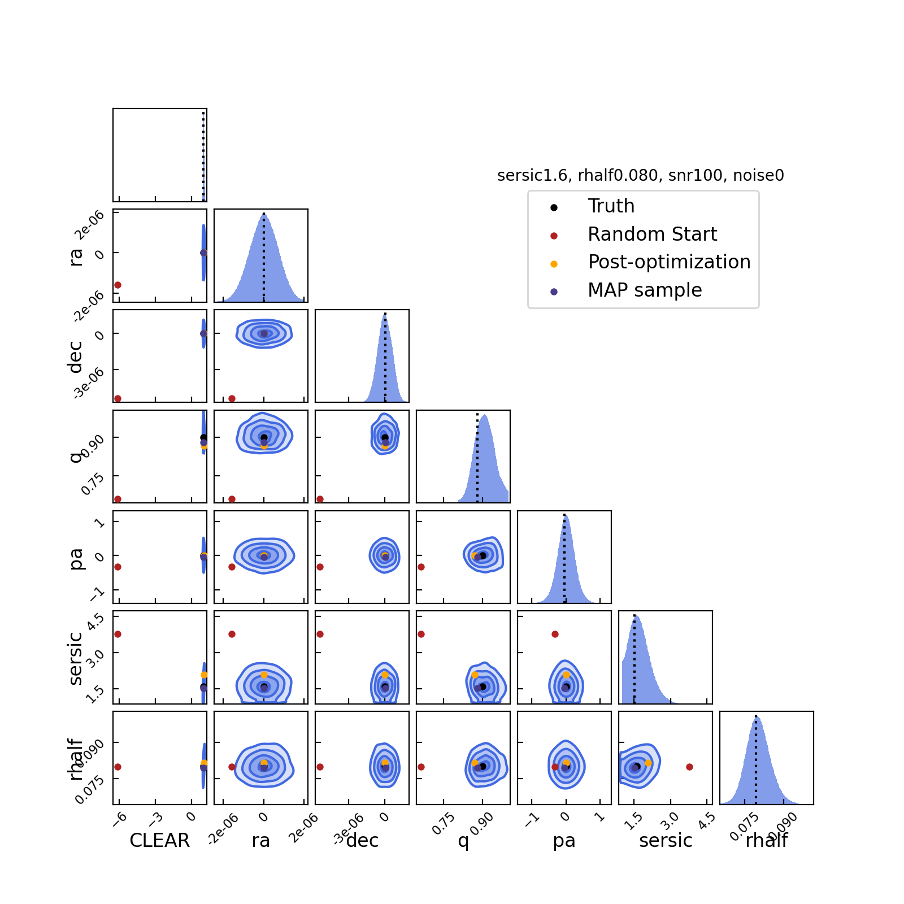

# Demo: Optimization

Generate a galsim image with specific parameters and fit it with forcepho using
HMC sampling, after first running a round of optimization.  Note that the linear
optimization of fluxes is currently only possible when using the GPU.

## setup

```sh
# get some common info
ln -s ../demo_utils.py demo_utils.py
ln -s ../data/sersic_splinedata_large.h5 sersic_splinedata_large.h5
```

## usage

Generate image, fit it, and plot corner with key parameter values marked.
```sh
python optimize.py --sersic 1.6 --rhalf 0.08 --snr 100 --add_noise 0
python optimize_plot.py output/sersic1.6_rhalf0.080_snr100_noise0/sersic1.6_rhalf0.080_snr100_noise0
```

