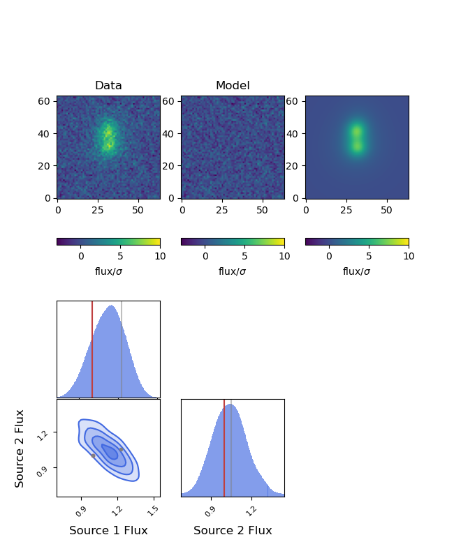

# Demo: Close Pair of Galaxies

In this demo we simultaneously fit two nearby sources in a single exposure.

```sh
# get some common info
ln -s ../demo_utils.py demo_utils.py
ln -s ../data/sersic_splinedata_large.h5 sersic_splinedata_large.h5

# make the mock image, with no noise realization added
python pair_make.py --add_noise 0
# fit the mock image
python pair_fit.py

# plot residuals and corner plot
python pair_plot.py
# make a movie showing posterior samples
python pair_movie.py
```

## `pair_make.py`

This script uses GalSim to make a (noisy) image of two galaxies in a single
band. The PSF is modeled as a single, symmetric Gaussian. The noise is modeled
as draws from an iid Gaussian in each pixel. Adjustable parameters in this
script include the fluxes, half-light radii and Sersic parameters of each
galaxy, as well as the separation between the centers of the two galaxies
expressed as a fraction of the half-light radius of the first source. The S/N
ratio  -- expressed as the S/N of the first source within the half-light radius
-- can be adjusted. The pixel scale and PSF width (in pixels) are also
adjustable.  The script also makes (or augments) a file called
`single_gauss_psf.h5` that contains the PSF data in forcepho format.  The final
FITS file has the following data model:

* `EXT1` - the GalSim model flux image, including added noise.
* `EXT2` - the flux uncertainty in each pixel.
* `EXT3` - the noise realization that was added to the GalSim model image.
* `EXT4` - A table of source parameters

In addition the header contains information about the WCS and the filter.

## `pair_fit.py`

This script fits the pair of sources using forcepho in sampling mode.  For the
initial guess catalog this uses the table of true source parameters in the last
extension of the demo data FITS file, and thus does not test for initial burn-in
or optimization issues.  The interface demonstrated here is the simple FITS file
`patch` with communication to and kernel execution in the CPU (as opposed to the
GPU).

## `pair_plot.py`

This script plots the data, residual, and model for the last iteration in the
chain as well as a corner plot for the fluxes of the two sources showing the
covariance.

## `pair_movie.py`

This script re-instantiates the model and generates models and residuals for
many samples from the chain.  These are shown in a movie, along with the
location of each sample in the corner plot from `pair_plot.py`

Here's one frame:
