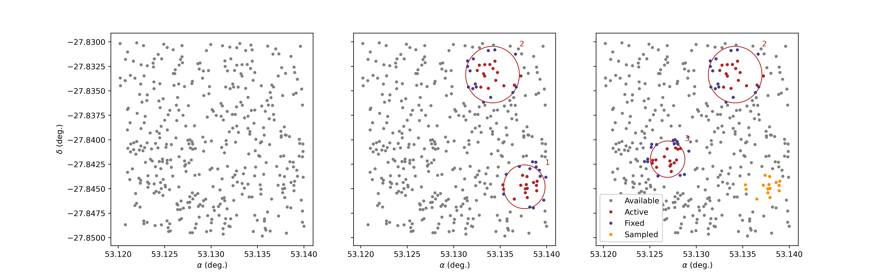

# Demo: Scenes and Patches

In this demo we show how to construct a superscene database and check out and
check-in fixed and active sources in scenes and subregions.

## `scene_plot.py`

Generates a superscene from a subset of the
[3DHST](https://archive.stsci.edu/prepds/3d-hst/) GOODS-S catalog, then checks
out a few scenes and plots active and and fixed sources.

