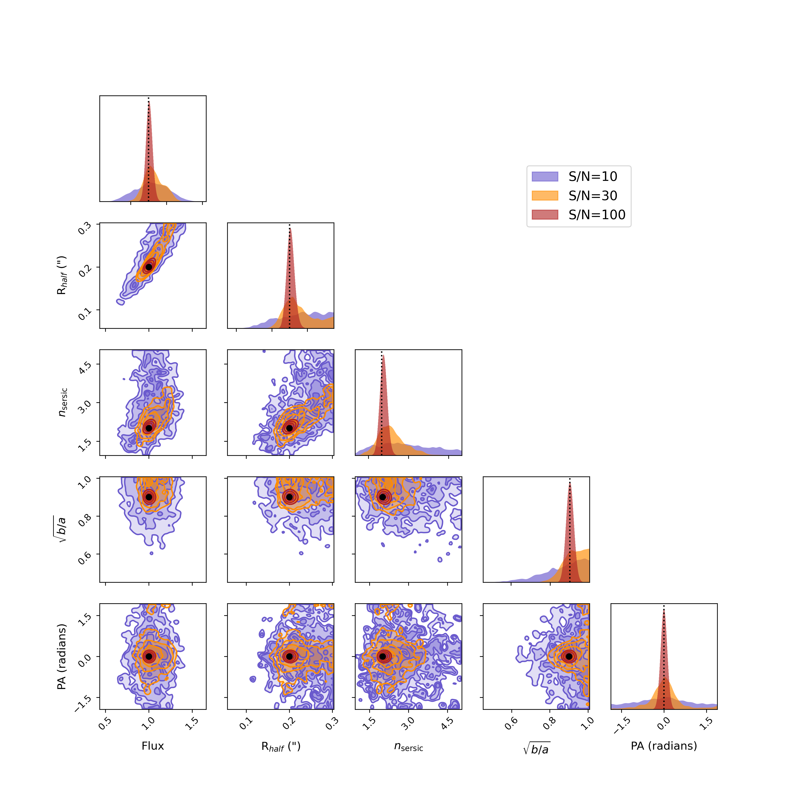
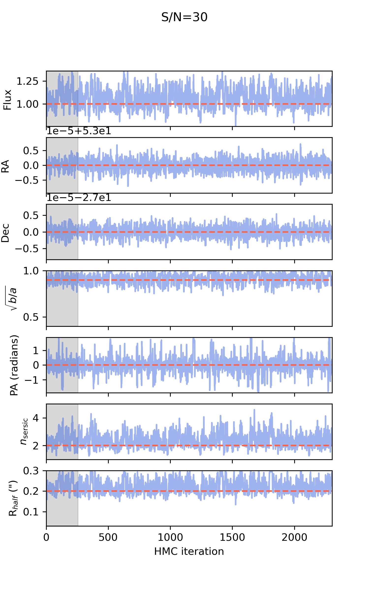

# Demo: Basic

In this demo we make and fit a single source in a single exposure but at
different S/N, and explore how the posteriors change as a function of S/N

```sh
# get some common info
ln -s ../demo_utils.py demo_utils.py
ln -s ../data/sersic_mog_model.smooth\=0.0150.h5 sersic_mog_model.smooth\=0.0150.h5

# make the test images
python single_make.py --add_noise 0 --snrlist 10 30 100

# fit the test images
python single_fit.py --image_name single_snr010.fits
python single_fit.py --image_name single_snr030.fits
python single_fit.py --image_name single_snr100.fits
```

## `single_make.py`

This script uses GalSim to make (noisy) images of a single galaxy in a single
band. The PSF is modeled as a single, symmetric Gaussian. The noise is modeled
as draws from an iid Gaussian in each pixel. Adjustable parameters in this
script include the flux, half-light radius and Sersic parameter of the galaxy.
The S/N ratio  -- expressed as the S/N of the source within the half-light
radius -- can be adjusted. The pixel scale and PSF width (in pixels) are also
adjustable.  The script also makes (or augments) a file called
`single_gauss_psf.h5` that contains the PSF data in forcepho format.  The final
FITS file has the following data model:

* `EXT1` - the GalSim model flux image, including noise if added.
* `EXT2` - the flux uncertainty in each pixel.
* `EXT3` - (optional) the noise realization that was added to the GalSim model image.
* `EXT4` - A table of source parameters in forcepho format.

In addition the header contains required information about the WCS and the
filter (in the "FILTER" keyword).

## `single_fit.py`

This script fits the source using forcepho in sampling mode.  For the initial
guess catalog this uses the table of true source parameters in the last
extension of the demo data FITS file, and thus does not test for initial burn-in
or optimization issues.  The interface demonstrated here is the simple FITS file
`patch` with communication to and kernel execution in the CPU (as opposed to the
GPU).

## `single_plot.py`

This script plots a corner plot for the source parameters as a function of S/N.
It also plots the MCMC traces for each parameter, and the residuals for the last
MCMC iteration.



