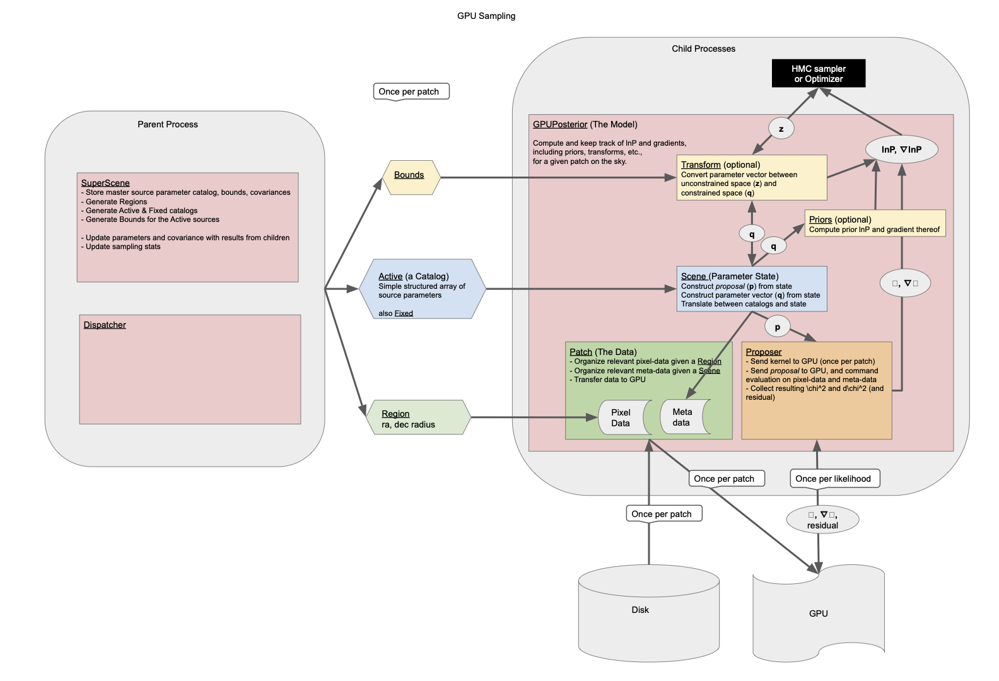

# Description

Forcepho is a code to infer the fluxes and shapes of galaxies from astronomical
images.  This is accomplished by modeling the appearance of multiple sources in
multiple bands simultaneously, and comparing to observed data via a likelihood
function.  Gradients of this likelihood allow for efficent maximization of the
posterior probability or sampling of the posterior probability distribution via
Hamiltonian Monte Carlo.

The model instrinsic galaxy shapes and positions are shared across the different
bands, but the fluxes are fit separately for each band.

Forcepho does *not* perform detection; initial locations and (very rough)
parameter estimates must be supplied by the user.

## Everything is made of Gaussians

Because Forcepho requires many evaluations of the model and its gradients, it
approximates both the point spread function in every band and the intrinsic
galaxy shape (Sersic profiles) as mixtures of Gaussians.  This allows for
convolution to be accomplished via simple sums of Gaussian parameters.  Lookup
tables defining these Gaussian approximations are a key input to the code.

## Scenes and Patches

The parameters describing a collection of sources on the sky is called a
**Scene**. Any collection of sources can define a scene; the set of all sources
that might appear in the collected data is referred to as a **SuperScene**.

Because of the data volumes involved, and the very large parameter space
required to represent multiple sources in many bands, Forcepho operates on small
regions of the sky independently.  These regions should still encompass all
sources that might be expected to overlap or strongly affect each other's
appearance.  All of the pixel data and meta-data (WCS, PSF, etc) from all
exposures in all bands within such a region is organized into a **Patch**.

Generally a region will also be associated with a small Scene of *active*
sources, i.e. those sources for which we wish to infer parameters using the
associated Patch data.  Additonal sources near the edge of the patch may be
collected into a *fixed* Scene; the parameters for these sources are held fixed
in the model while the those of the active scene are inferred.

## Optimization and Sampling

Forcepho can either maximize the log-posterior probability or sample from the
posterior probability density.  It is recommeded to perform an initial
optimization and to use the results of that optimization as the starting
location for sampling.

In addition to optimization of all Scene parameters via the BFGS algorithm, a
linear-least squares algorithm exists to optimize the fluxes conditional on a
set of galaxy shapes.  This procedure also produces uncertainty estimates for
the fluxes.

The sampling is accomplished via Hamiltonian Monte Carlo.  This algorithm takes
advantage of likelihood and exact likelihood-gradient information to construct
trajectories through the parameter space that result in efficient sampling.
This is particularly important when simultaneously inferring multi-band fluxes
of multiple sources, where the number of parameters to infer can be in the
hundreds.

## Parents and children

Since Forcepho operates on many different regions of the sky more or less
independently, it is well suited to parallel processing approaches.  The
approach used here is to identify a **parent** process that can check-out
individual regions and small corresponding sub-scenes from a so-called "Super
Scene", a collection of all sources that might appear in the data. These regions
and sub-scenes can then be passed on to **child** processes that accomplish the
assigned task -- optimization or sampling of the sub-scene source parameters --
and report the results back to the parent for check-in.

The regions of the sky that can be treated independently and simultaneously by
separate child processes will be widely separated on the sky.  In order to
ensure that all sources are modeled, scenes will continue to be checked-out in
an iterative manner until every source has had the requested number of samples
produced.  This can lead to sources appearing in multiple overlapping patches.

## CPU/GPU

## Code structure

Graphic design is my passion

